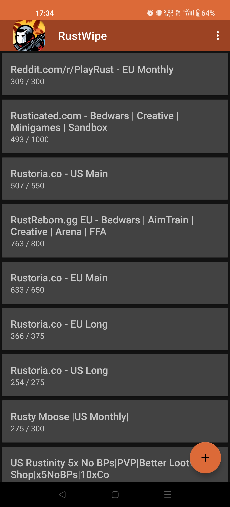
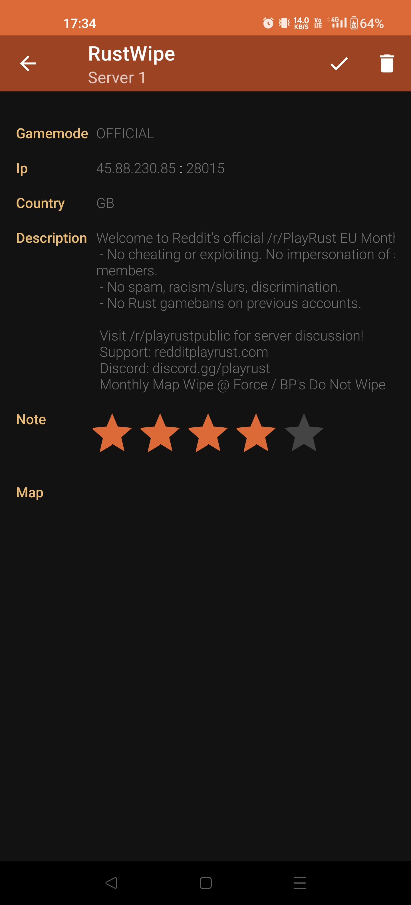
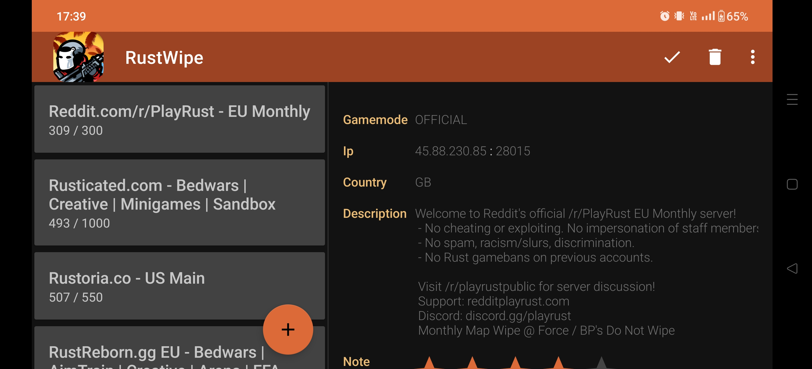

# RustWipe

## 📝 Purpose

Shows the "*high populated*" [Rust]() servers thanks to the [battlemetrics api](https://www.battlemetrics.com/servers/rust) + [retrofit2](https://square.github.io/retrofit) and then locally store them using [room](https://developer.android.com/jetpack/androidx/releases/room).

## 🛠 Languages & tools

    

## 🖊️ Versions 

- [Android API](https://developer.android.com/reference) 16 to 33

## 📍 Visuals

| Master | Detail |
| --- | --- |
|  |  |

| Booth |
| --- |
| 

## ✍️ Credits 

* Author: [**Valetin Clergue**](https://github.com/HandyS11)